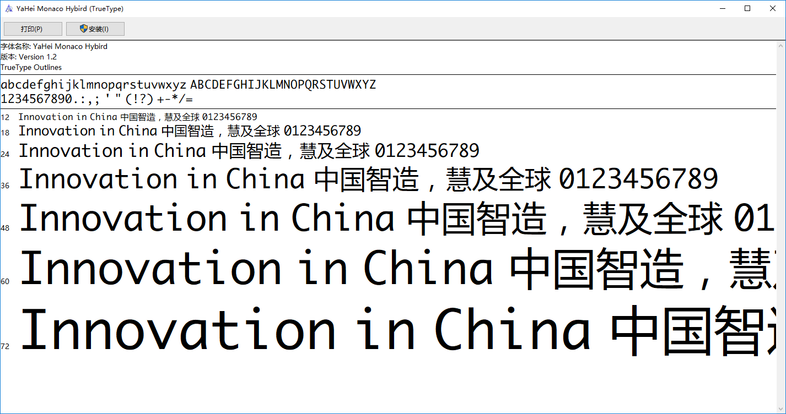
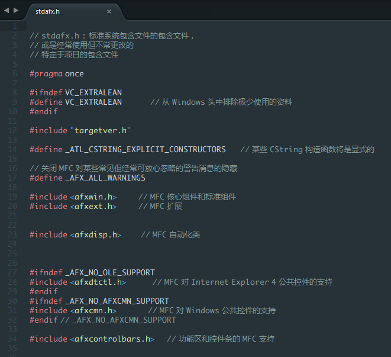
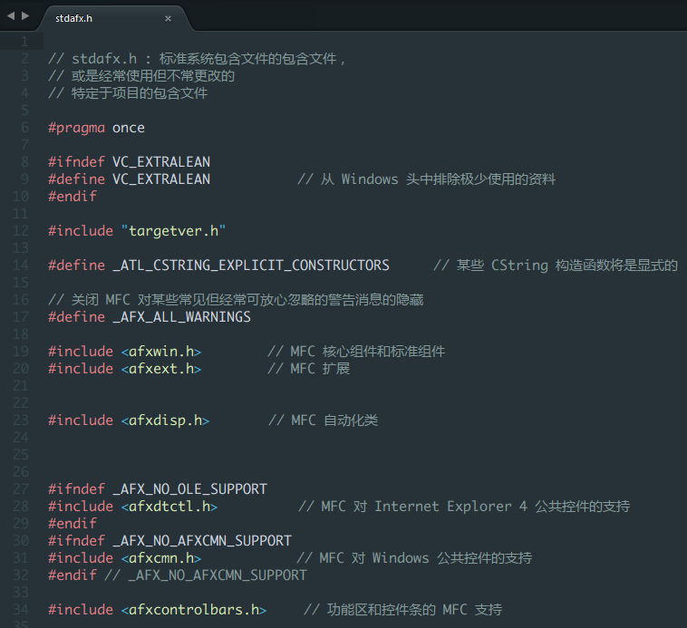
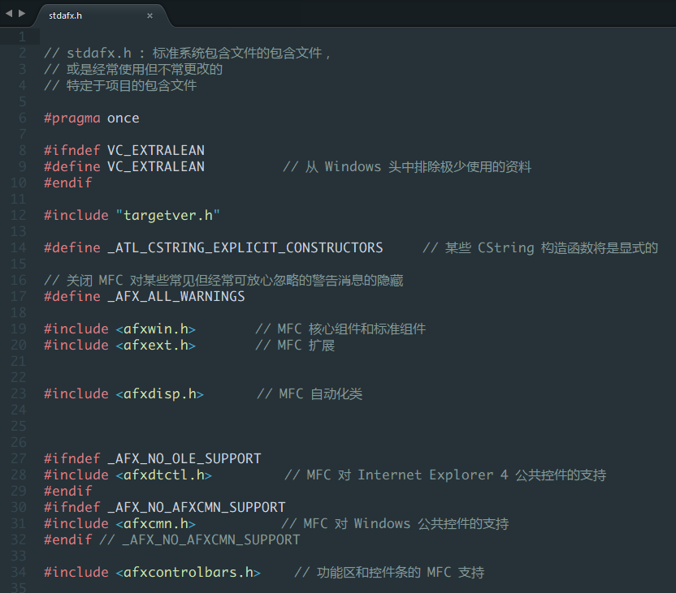
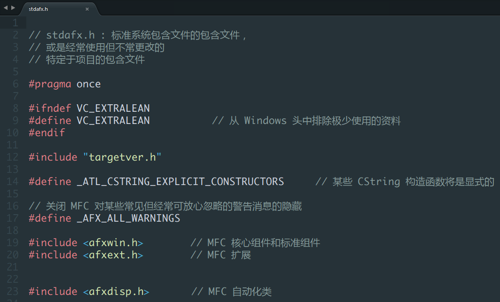

# Yahei Monaco Hybrid 混合字体

## 更新说明

v1.3

	修改空格宽度为 1024（汉字宽度为 2048，4 个空格等于两个汉字）。优化调整数字宽度。

v1.2

	修复 Hingting 问题，调整部分字母过长，重叠问题等。

v1.1

	首次发布，没什么好说的

>主要用于撸代码！！！啊啊啊啊啊啊！！！

* 没有用 Font Creator 操作了，Hingting 不 Hingting 都不对！但是编辑字体和调试预览功能很棒！

* 将 `Monaco` 的英文字母、数字、部分运算符号等应用到微软雅黑中

* 不明确还有什么鬼 BUG，发现了再操作修改...好吧，先用着

* 放几张图：

    ### Windows 字体预览

    
    
    ---

    ### Sublime Text 3 中 10 号字体预览

    

    ---

    ### Sublime Text 3 中 11 号字体预览

    

    ---

    ### Sublime Text 3 中 12 号字体预览

    

    ---

    ### Sublime Text 3 中 16 号字体预览

    

    ---
